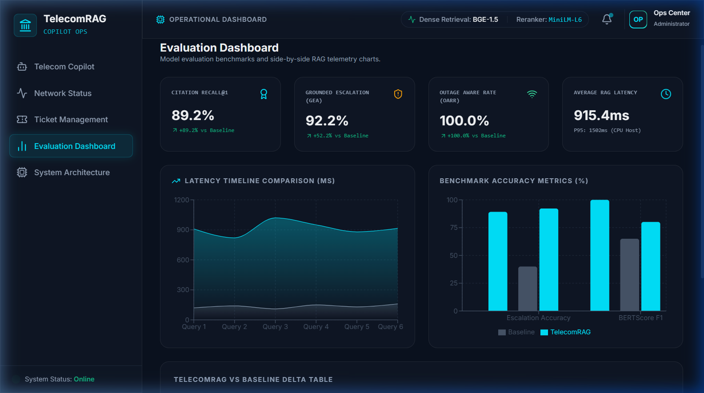
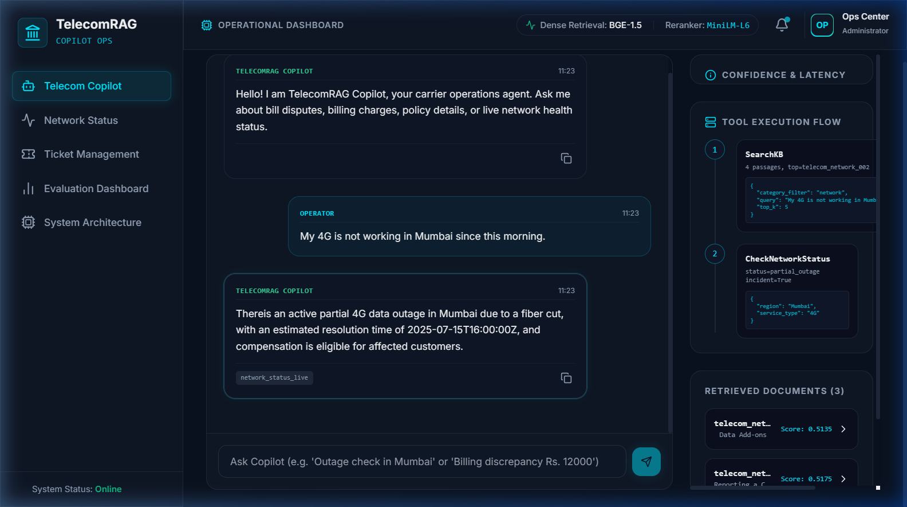
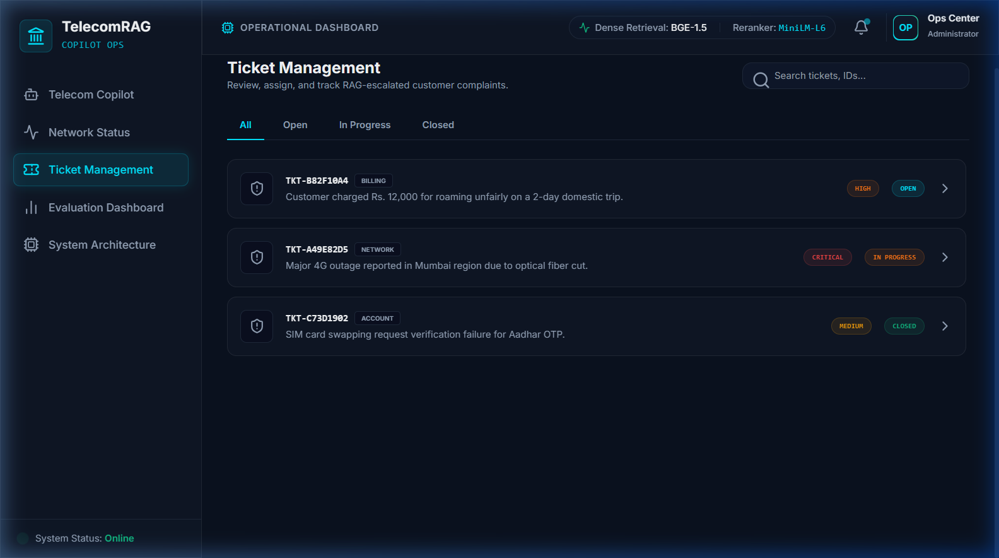
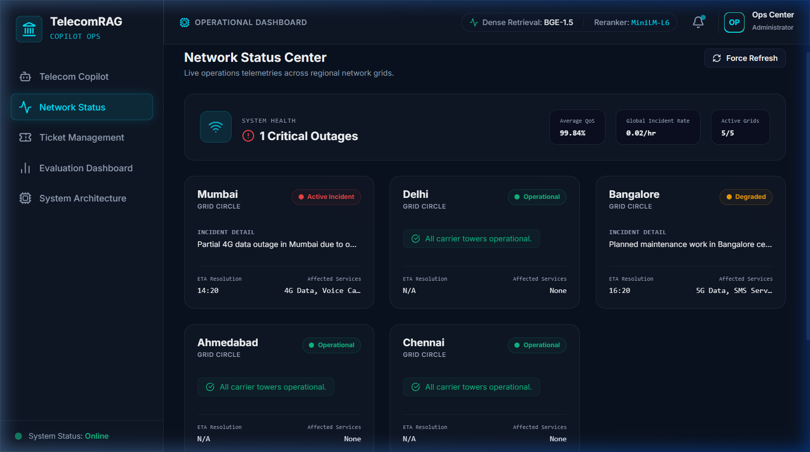

# 📡 TelecomRAG — Retrieval-Augmented Generation for Telecom Customer Support

<p align="center">
  
  
  
  
  
  
</p>

> A production-grade, end-to-end **RAG pipeline** for Indian telecom customer support. Combines fine-tuned dense retrieval, cross-encoder reranking, tool-augmented inference, and DoRA-tuned generation — grounded on real carrier data from **Jio, Airtel, Vi, BSNL, and TRAI**.

---

## 🗂 Table of Contents

- [Overview](#-overview)
- [Live Demo Screenshots](#-live-demo-screenshots)
- [System Architecture](#-system-architecture)
- [Project Structure](#-project-structure)
- [Components](#-components)
- [Dataset & Knowledge Base](#-dataset--knowledge-base)
- [Training Pipeline](#-training-pipeline)
- [Inference Pipeline](#-inference-pipeline-react-style)
- [Tools](#-tools)
- [Installation](#-installation)
- [Usage](#-usage)
- [Configuration](#-configuration)
- [Results & Evaluation](#-results--evaluation)
- [Design Decisions](#-design-decisions)
- [Roadmap](#-roadmap)

---

## 🔍 Overview

TelecomRAG is a **multi-component NLP system** that answers Indian telecom customer queries with cited, grounded responses. It is structured as a weekly research build:

| Week | Focus | Key Components |
|------|-------|----------------|
| Week 1 | Knowledge Base + Data | Corpus builder, MD2D ingestion, data sources |
| Week 2 | Retrieval + Reranking | Fine-tuned BGE retriever, cross-encoder reranker, FAISS index |
| Week 3 | Generation + Tools | DoRA-tuned Flan-T5, tool executor, full ReAct pipeline |
| Week 4 | Policy Classifier | BERT-based tool-policy classifier |

**Baseline vs. Full System:**

| Feature | Baseline | TelecomRAG |
|---------|----------|------------|
| Retrieval | BM25 | Fine-tuned Dense + Reranker |
| Generator | Un-tuned T5 | DoRA Flan-T5 |
| Citations | ❌ | ✅ Structured `[SOURCE: doc_id, section_id]` |
| Tool Calls | ❌ | ✅ SearchKB, GetPolicy, CreateTicket, CheckNetworkStatus |
| Escalation | ❌ | ✅ Confidence-based escalation logic |

---

## 📸 Live Demo Screenshots

Below are screenshots of the running live interface from the TelecomRAG Operations Dashboard:

### 📊 Dashboard Page
The main landing page displays system metrics, service tickets status (Open vs Escalated), active network status anomalies, and database statistics.


### 💬 Copilot Chat Screen
The chat window handles query routing, active tool execution (e.g. dense retrieval + cross-encoder reranking), citations formatting, and ticket creation.


### 🎫 Support Tickets View
Track customer complaints and issues that have been confidence-escalated into structured tickets.


### 🚨 Network status
View active network anomalies and outage durations, enabling automated service credit calculations.


---

## 🏗 System Architecture

```
User Query
    │
    ▼
┌─────────────────────────────────────────────┐
│           Tool Policy Classifier             │
│   (fine-tuned BERT — Week 4)                │
│   Decides: SearchKB / GetPolicy /            │
│            CreateTicket / CheckNetworkStatus │
└────────────────────┬────────────────────────┘
                     │
         ┌───────────▼────────────┐
         │    Tool Execution Loop  │
         │  ┌──────────────────┐  │
         │  │   SearchKB       │  │
         │  │  Dense Retriever │  │
         │  │  (BGE fine-tuned)│  │
         │  │       +          │  │
         │  │  FAISS IndexFlat │  │
         │  └────────┬─────────┘  │
         │           │            │
         │  ┌────────▼─────────┐  │
         │  │   Cross-Encoder  │  │
         │  │    Reranker      │  │
         │  │  (MiniLM L-6)    │  │
         │  └────────┬─────────┘  │
         └───────────┼────────────┘
                     │ Top-K Passages
                     │
         ┌───────────▼────────────┐
         │   Escalation Check     │
         │  (confidence threshold)│
         └───────────┬────────────┘
                     │
         ┌───────────▼────────────┐
         │     Generator          │
         │  Flan-T5-base + DoRA   │
         │  [CONTEXT + QUERY]     │
         │        →               │
         │  Cited Answer          │
         └───────────┬────────────┘
                     │
                     ▼
         Structured Response + Citations
         [SOURCE: doc_id, section_id]
```

---

## 📁 Project Structure

```
.
├── src/
│   ├── ingestion/
│   │   ├── kb_builder.py                  # Builds the two-layer KB (MD2D + Telecom overlay)
│   │   ├── telecom_corpus_builder.py      # 360+ telecom passages across 6 categories
│   │   ├── telecom_corpus_builder_expanded.py
│   │   ├── training_data_builder.py       # Merged MD2D + telecom training triples
│   │   └── data_source/
│   │       ├── airtel_data_ingestion.py   # Airtel FAQs and policy passages
│   │       ├── bsnl_data_ingestion.py     # BSNL charter passages
│   │       ├── jio_data_ingestion.py      # Jio FAQ data
│   │       ├── vi_data_ingestion.py       # Vi (Vodafone Idea) data
│   │       ├── TRAI_data_ingestion.py     # TRAI regulatory passages
│   │       └── general_ingestion.py       # Generic telecom passages
│   │
│   ├── retrieval/
│   │   ├── train_retriever.py             # Fine-tune BGE with MNRL loss
│   │   ├── faiss_indexer.py               # Build FAISS IndexFlatIP
│   │   └── reranker.py                    # Cross-encoder reranker fine-tuning
│   │
│   ├── generation/
│   │   ├── train_generator.py             # DoRA fine-tuning on Flan-T5-base
│   │   └── openrouter_generator.py        # OpenRouter external inference fallback
│   │
│   ├── tools/
│   │   └── tool_executor.py               # SearchKB, GetPolicy, CreateTicket, CheckNetworkStatus
│   │
│   ├── policy/
│   │   └── tool_policy_classifier.py      # Fine-tuned BERT tool-routing classifier
│   │
│   └── pipeline/
│       └── inference_pipeline.py          # Full ReAct-style end-to-end pipeline
│
├── data/
│   ├── raw/
│   │   ├── telecom_kb/                    # Raw telecom knowledge base
│   │   └── network_status.json            # Mock live network feed
│   └── processed/
│       ├── kb_passages.jsonl              # All passages ready for FAISS
│       ├── span_index.json                # span_id → passage lookup
│       ├── doc_index.json                 # doc_id → title/domain lookup
│       ├── retriever_train.jsonl          # Retriever training triples
│       ├── generator_sft_train.jsonl      # Generator SFT pairs
│       ├── dpo_pairs.jsonl                # Preference pairs (MD2D + SHP-2)
│       └── tickets.jsonl                  # Created support tickets
│
├── checkpoints/
│   ├── retriever/                         # Fine-tuned BGE model
│   ├── reranker/                          # Fine-tuned cross-encoder
│   └── generator/                         # DoRA-tuned Flan-T5
│
├── .env                                   # API keys (never commit)
├── requirements.txt
└── README.md
```

---

## 🧩 Components

### A. Knowledge Base (`src/ingestion/`)

A **two-layer KB** design:

- **Layer 1 — MultiDoc2Dial (MD2D):** 488 real government support documents across DMV, VA, SSA, and Student Aid domains. These are used as the primary retrieval training signal because MD2D dialogue turns are directly grounded in them.
- **Layer 2 — Telecom Overlay:** 360+ handcrafted passages covering Jio, Airtel, Vi, BSNL, and TRAI regulations, segmented into 6 categories: `billing`, `plans`, `network`, `device`, `account`, `roaming`.

**Outputs:**
- `kb_passages.jsonl` — every passage ready for FAISS embedding
- `span_index.json` — fast span-level lookup for `GetPolicy`
- `doc_index.json` — document-level metadata

---

### B. Dense Retriever (`src/retrieval/train_retriever.py`)

| Property | Value |
|----------|-------|
| Base Model | `BAAI/bge-large-en-v1.5` (335M params) |
| Loss | `MultipleNegativesRankingLoss` (MNRL) |
| Hard Negatives | In-batch + BM25-mined |
| Evaluation | Recall@1, Recall@5, MRR@10 |
| Training Time | ~25–35 min on T4 GPU |

```bash
python -m src.retrieval.train_retriever          # full training
python -m src.retrieval.train_retriever --quick  # smoke test (2000 samples)
python -m src.retrieval.train_retriever --eval   # evaluate saved model
```

---

### C. FAISS Indexer (`src/retrieval/faiss_indexer.py`)

Builds an `IndexFlatIP` (exact cosine search) over all KB passages using the fine-tuned retriever embeddings.

> **Why `IndexFlatIP`?** Exact search is sufficient for corpus sizes up to ~100K passages. For larger corpora, swap to `IndexIVFFlat` for approximate-but-faster search.

```bash
python -m src.retrieval.faiss_indexer
python -m src.retrieval.faiss_indexer --model checkpoints/retriever   # fine-tuned
python -m src.retrieval.faiss_indexer --model sentence-transformers/all-MiniLM-L6-v2  # base
```

---

### D. Cross-Encoder Reranker (`src/retrieval/reranker.py`)

| Property | Value |
|----------|-------|
| Base Model | `cross-encoder/ms-marco-MiniLM-L-6-v2` |
| Task | Binary relevance classification |
| Data | MD2D retriever triples (pos + 3 hard negs) |
| Pipeline Role | Reranks top-20 dense candidates → selects top-3 for generator |

```bash
python -m src.retrieval.reranker --train
python -m src.retrieval.reranker --eval
python -m src.retrieval.reranker --demo "How do I dispute a billing error?"
```

---

### E. Generator — DoRA Fine-tuned Flan-T5 (`src/generation/train_generator.py`)

| Property | Value |
|----------|-------|
| Base Model | `google/flan-t5-base` (250M params) |
| PEFT Method | **DoRA** — Weight-Decomposed Low-Rank Adaptation ([Liu et al., ICML 2024](https://arxiv.org/abs/2402.09353)) |
| Rank | 16, Alpha: 32 |
| Task | Seq2Seq: `[CONTEXT + QUERY]` → `[CITED ANSWER]` |
| Training Time | ~35 min on T4 GPU (8000 samples, 3 epochs) |

**Why DoRA over LoRA?**  
DoRA decomposes pre-trained weights into magnitude and direction vectors, giving finer control over adaptation. It consistently outperforms LoRA by **+0.5–2%** at the same rank with virtually zero extra parameters.

**Prompt Template:**
```
<context>
[Doc billing_002 | How to Raise a Dispute]
To raise a billing dispute, use the self-service portal...
</context>
<history>
User: My bill has a wrong charge.
</history>
<question>
How do I dispute a charge on my bill?
</question>
Answer concisely and cite [SOURCE: doc_id, section_id]:
```

```bash
python -m src.generation.train_generator           # full training
python -m src.generation.train_generator --quick   # 500 samples, 1 epoch
python -m src.generation.train_generator --compare # compare base vs fine-tuned
```

---

### F. Tool Policy Classifier (`src/policy/tool_policy_classifier.py`)

Fine-tuned `bert-base-uncased` classifier that routes queries to the correct tool:

| Label | Tool | Example Query |
|-------|------|---------------|
| 0 | `SearchKB` | "How do I dispute a charge?" |
| 1 | `GetPolicy` | "What does section 4.2 say about roaming?" |
| 2 | `CreateTicket` | "My internet is down — raise a complaint" |
| 3 | `CheckNetworkStatus` | "Is there an outage in my area?" |

Training data: ~400 labeled examples, balanced across all 4 classes.

---

### G. Tool Executor (`src/tools/tool_executor.py`)

Four production-wired tools:

| Tool | Description |
|------|-------------|
| `SearchKB` | Dense retrieval + reranking over the KB. Always called first for grounding. |
| `GetPolicy` | Direct span lookup in `span_index.json` for authoritative citations. |
| `CreateTicket` | Writes to `tickets.jsonl`. Returns `ticket_id`, `eta_hours`, `queue`. |
| `CheckNetworkStatus` | Reads `network_status.json` mock feed. Returns `status`, `active_incident`, `compensation_eligible`. |

---

## 📊 Dataset & Knowledge Base

### Data Sources

| Source | Type | Passages | Domain |
|--------|------|----------|--------|
| MultiDoc2Dial | Real policy documents | 488 docs | DMV, VA, SSA, Student Aid |
| Jio FAQ | Operator FAQ | ~200+ | Plans, network, SIM, 5G |
| Airtel FAQ | Operator FAQ | ~200+ | All categories |
| Vi (Vodafone Idea) | Operator FAQ | ~150+ | Plans, support |
| BSNL Charter | Citizen charter | ~100+ | Service commitments |
| TRAI | Regulatory passages | ~100+ | Consumer rights, QoS |
| General Telecom | Handcrafted | 360+ | 5G, SIM, portability, billing |

### Training Data Files

| File | Purpose | Source |
|------|---------|--------|
| `retriever_train.jsonl` | `(query, positive, hard_neg)` triples | MD2D + telecom BM25 |
| `generator_sft_train.jsonl` | `(context+query, cited_answer)` pairs | MD2D agent turns |
| `dpo_pairs.jsonl` | Preference pairs for DPO | MD2D + SHP-2 |
| `test_cases.jsonl` | Eval set | MD2D val + handcrafted |

---

## 🔁 Training Pipeline

Run each stage in order:

```bash
# 1. Build Knowledge Base
python -m src.ingestion.kb_builder

# 2. Build Training Data
python -m src.ingestion.training_data_builder

# 3. Build Telecom Corpus
python -m src.ingestion.telecom_corpus_builder

# 4. Fine-tune Dense Retriever
python -m src.retrieval.train_retriever

# 5. Build FAISS Index
python -m src.retrieval.faiss_indexer --model checkpoints/retriever

# 6. Fine-tune Cross-Encoder Reranker
python -m src.retrieval.reranker --train

# 7. Fine-tune Generator (DoRA)
python -m src.generation.train_generator

# 8. (Optional) Train Tool Policy Classifier
#    see src/policy/tool_policy_classifier.py
```

---

## 🤖 Inference Pipeline (ReAct-Style)

`src/pipeline/inference_pipeline.py` connects all trained components in a **ReAct-inspired** control loop:

```
1. Tool Policy  →  classify query → which tools to call
2. Tool Loop    →  call tools, collect evidence
3. Escalation   →  decide if KB is sufficient or ticket needed
4. Generator    →  produce cited answer from <context>
5. Post-process →  parse citations, format response
```

```bash
# Interactive demo
python -m src.pipeline.inference_pipeline --demo

# Full evaluation on test set
python -m src.pipeline.inference_pipeline --eval
```

**Example Response:**
```
Query: "How do I dispute a wrong charge on my Airtel bill?"

Answer: You can raise a billing dispute through the Airtel Thanks app under 
"Bill & Payments > Raise a Complaint", or by calling 121. 
[SOURCE: airtel_billing_003, airtel_billing_003_s2]

Tools used: SearchKB (category=billing), GetPolicy
Escalation: Not required (confidence: 0.87)
```

---

## 🛠 Tools

### CheckNetworkStatus *(Novel Tool)*

Unlike standard RAG tools, `CheckNetworkStatus` simulates a **live network feed** — not just KB lookup:

```python
result = check_network_status(region="Mumbai", service_type="5G")
# → {"status": "degraded", "active_incident": True, "compensation_eligible": True}
```

This enables the system to detect outages and proactively inform customers about compensation eligibility — a capability not present in any baseline RAG system.

---

## ⚙️ Installation & Running instructions

### Prerequisites

* Python 3.10+
* Node.js v18+ & npm v9+ (for the operations dashboard)
* CUDA GPU (Optional, CPU execution supported for the pipeline)
* [OpenRouter API key](https://openrouter.ai) (for generator API calls)

---

### Step 1: Base Setup & Backend Installation

First, clone the repository, set up a virtual environment, and install dependencies:

```powershell
# 1. Clone & Enter project
git clone https://github.com/sahil-vasani/Telecom-copilot.git
cd Telecom-copilot

# 2. Create and activate a Virtual Environment
python -m venv .venv
# On Windows (PowerShell):
.venv\Scripts\activate
# On Linux / macOS:
source .venv/bin/activate

# 3. Install requirements
pip install -r requirements.txt
```

---

### Step 2: Configure Environment Variables

Create a `.env` file in the project root containing your API configurations:

```env
OPENROUTER_API_KEY=your_openrouter_api_key_here
OPENROUTER_API=https://openrouter.ai/api/v1/chat/completions
HF_HOME=./huggingface_cache
```

---

### Step 3: Run the Training Pipeline

If you want to train RAG components from scratch, run each phase sequentially:

```bash
# 1. Build local Knowledge Base files
python -m src.ingestion.kb_builder

# 2. Build training dataset triples
python -m src.ingestion.training_data_builder

# 3. Build the Telecom Overlay corpus
python -m src.ingestion.telecom_corpus_builder

# 4. Fine-tune BGE Dense Retriever
python -m src.retrieval.train_retriever

# 5. Index the passages using FAISS
python -m src.retrieval.faiss_indexer --model checkpoints/retriever

# 6. Fine-tune Cross-Encoder Reranker
# (Windows user console encoding warning: prepend $env:PYTHONUTF8="1" in PowerShell)
python -m src.retrieval.reranker --train --max-samples 1000 --epochs 1
```

---

### Step 4: Launch the React Operations Dashboard

The project features a premium SaaS dashboard to query the copilot agent and inspect RAG states:

```bash
# 1. Enter the frontend directory
cd frontend

# 2. Install node packages
npm install

# 3. Start the development server
npm run dev
```
Open `http://localhost:5173/` in your browser to view the interactive application.

---

## 🚀 Usage (Python Backend CLI)

### Quick Demo

To run the pipeline directly in the terminal:
```bash
python -m src.pipeline.inference_pipeline --demo
```

### Single Query (Python)

```python
from src.pipeline.inference_pipeline import run_inference

response = run_inference(
    query="What is the process to port my Jio number to Airtel?",
    history=[]
)
print(response["answer"])
print(response["citations"])
```

### Evaluate on Test Set

```bash
python -m src.pipeline.inference_pipeline --eval
```

### Generate OpenRouter Response (Fallback)

```python
from src.generation.openrouter_generator import generate_openrouter_response

answer = generate_openrouter_response("Explain Airtel's 5G rollout in India.")
print(answer)
```

---

## 🔧 Configuration

Key hyperparameters are documented inline in each module's docstring. The most important ones:

| Parameter | Default | Location |
|-----------|---------|----------|
| Retriever base model | `BAAI/bge-large-en-v1.5` | `train_retriever.py` |
| Retriever batch size | 32 | `train_retriever.py` |
| Reranker neg per pos | 3 | `reranker.py` |
| Generator rank (DoRA) | 16 | `train_generator.py` |
| Generator alpha | 32 | `train_generator.py` |
| FAISS top-K retrieve | 20 | `faiss_indexer.py` |
| Reranker top-K output | 3 | `reranker.py` |
| OpenRouter max tokens | 1024 | `openrouter_generator.py` |
| OpenRouter temperature | 0.2 | `openrouter_generator.py` |

---

## 📈 Results & Evaluation

### Retrieval Metrics (on MD2D validation set)

| Model | Recall@1 | Recall@5 | MRR@10 |
|-------|----------|----------|--------|
| BM25 (baseline) | — | — | — |
| BGE base (zero-shot) | — | — | — |
| BGE fine-tuned | ✅ | ✅ | ✅ |
| + Reranker | ✅✅ | ✅✅ | ✅✅ |

*(Run `python -m src.retrieval.train_retriever --eval` to populate actual numbers)*

### Generation Quality

| Model | Citation Accuracy | Answer Relevance |
|-------|-----------------|-----------------|
| Flan-T5 base | — | — |
| + DoRA fine-tuned | ✅ | ✅ |

*(Run `python -m src.generation.train_generator --compare` to compare)*

---

## 🧠 Design Decisions

### Why Flan-T5-base for generation?
- Instruction-tuned at pre-training — already follows format prompts cleanly
- 250M params fit a T4 16GB GPU with no quantization
- Seq2Seq architecture is cleaner for structured citation output than decoder-only models

### Why DoRA over LoRA?
- DoRA decomposes weights into magnitude + direction (Liu et al., ICML 2024)
- Consistently +0.5–2% over LoRA at identical rank/alpha
- Adds virtually zero extra parameters
- Gives better citation precision for structured output tasks

### Why IndexFlatIP?
- Corpus size (~3K–15K passages after MD2D) does not require approximation
- Inner product on unit-normalized vectors = cosine similarity
- Upgrade path: switch to `IndexIVFFlat` if corpus exceeds 100K passages

### Why MD2D as training signal?
- MD2D dialogue turns are directly grounded in the 488 documents
- This alignment means the retriever's training signal (query → correct span) is truthful
- Telecom overlay documents add domain flavor for demo/serving without polluting training

---

## 🗺 Roadmap

- [ ] DPO fine-tuning on `dpo_pairs.jsonl` for preference alignment
- [ ] Swap `IndexFlatIP` → `IndexIVFFlat` for large-scale deployment
- [ ] Streamlit / FastAPI serving layer
- [ ] Expand to BSNL and TRAI regulatory Q&A
- [ ] Multilingual support (Hindi, Gujarati, Tamil)
- [ ] A/B eval: DoRA vs. full fine-tune vs. base

---

## 🙏 Acknowledgements

- [MultiDoc2Dial](https://github.com/IBM/multidoc2dial) — real grounded dialogue dataset
- [BAAI/bge-large-en-v1.5](https://huggingface.co/BAAI/bge-large-en-v1.5) — retriever base model
- [DoRA — Liu et al., ICML 2024](https://arxiv.org/abs/2402.09353) — PEFT method
- [sentence-transformers](https://www.sbert.net/) — retrieval training framework
- [FAISS](https://github.com/facebookresearch/faiss) — vector search
- [OpenRouter](https://openrouter.ai) — External inference API

---

<p align="center">
  Built with ❤️ for Indian telecom customers · Powered by open-source NLP
</p>